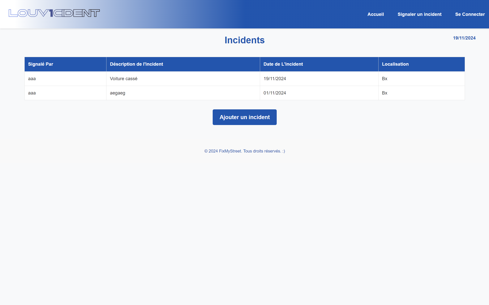
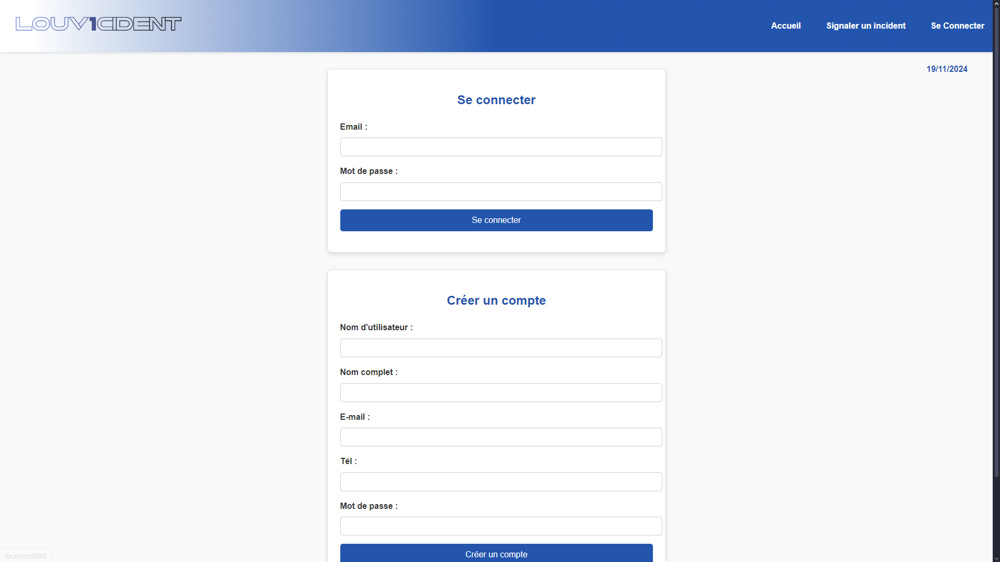
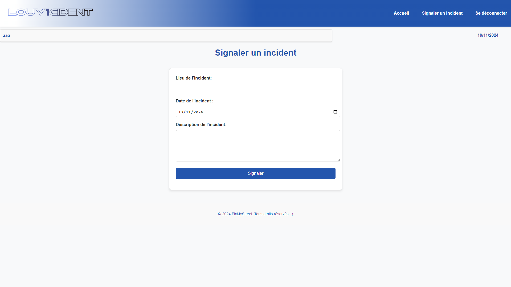

# Description du projet
Voici le projet préparatoire en Approfondissement informatique (LINFO1212).

Il nous est demandé de créer un site inspiré de fixmystreet.brussels mais pour la commune d'Ottignies-Louvain-la-Neuve.
Notre site se concentrera donc sur les incidents qui se produisent dans cette commune, vous pourrez créer votre compte et ajouter des incidents lorsque vous en voyez, et également voir la liste des incidents qui les autres utilisateurs auraient ajouté.

# Notre équipe
Nous sommes le groupe A08 composé de :
    - El Mandili Douaa
    - Lacheron Edouard
    - Wu Jialin

# Pour lancer le site
Utiliser la commande 
    node server.js
Le site se lancera en localhost sur le port 8080 (accessible sur http://localhost:8080)

# Package à installer
Pour pouvoir lancer le site voici les packages qui doivent être installer :
    - "bcrypt": "5.1.1",
    - "ejs": "3.1.10",
    - "express": "4.21.0",
    - "mongoose": "8.8.1",
    - "express-session": "^1.18.1",
    - "connect-mongodb-session": "^5.0.0"

# La database
La batabase MongoDB se connectera en local sur le port 27017 dans la collection fixmystreet

# Capture d'écran

Groupe A08 - Louv1cident - 28/09/2024